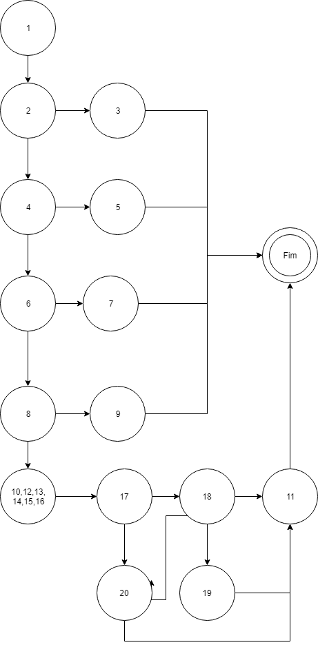

# ISS Ateliê

### Login
Para realizar login no sistema ISS Ateliê, é preciso preencher as credenciais `usuário` e `senha` conforme exibido na imagem abaixo.  

### Consultora
Para `listar todas as consultora`, clique no menu de Consultoras, conforme exibido abaixo.

Para `inserir uma consultora`, clique no botão cadastrar consultoras, conforme exibido abaixo.

Em seguida preencha os dados solicitados e clique no botão `salvar`, conforme exibido abaixo.

Para `alterar e inativar uma consultora`, clique no nome da consultora derejada, conforme exibido abaixo.

Em seguida altere os dados, sendo que caso queira inativa-la, basta marcar desmarcar a opção `status`. Para salvar as alterações, basta clicar no botão `salvar`, conforme exibido abaixo.

