# ISS Ateliê
## Luis
### Login
Para realizar login no sistema ISS Ateliê, é preciso preencher as credenciais `usuário` e `senha` conforme exibido na imagem abaixo.  
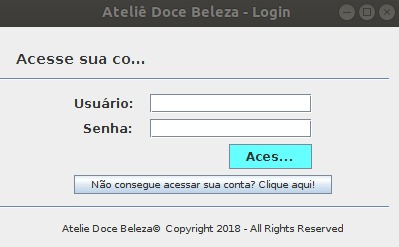

### Gerenciar Consultora
#### Listar Consultora
Para `listar todas as consultora`, clique no menu de Consultoras, a partir do menu principal.

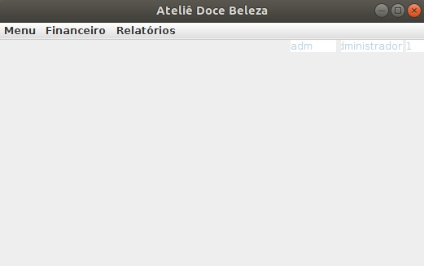

Em seguida, a tela de listagem de consultoras estará disponível, conforme exibido abaixo.

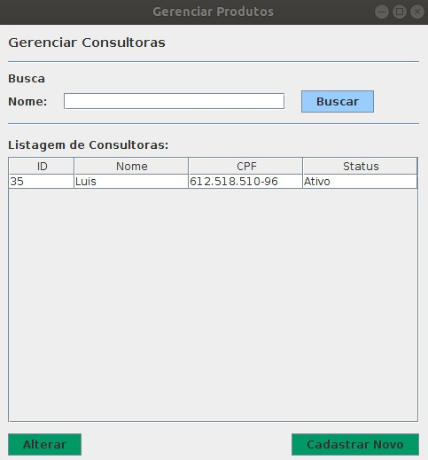

#### Inserir Consultora
Para `inserir uma consultora`, clique no botão `Cadastrar Novo`, a partir da tela de listagem de consultora, conforme exibido abaixo.

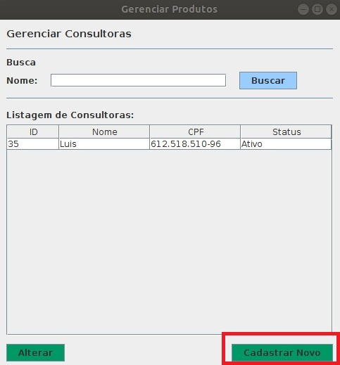

Em seguida preencha os dados solicitados e clique no botão `salvar`, conforme exibido abaixo.

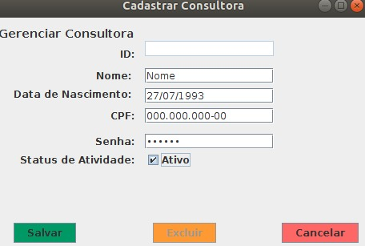

#### Alterar Consultora
Para `alterar e inativar uma consultora`, clique no nome da consultora derejada, conforme exibido abaixo.

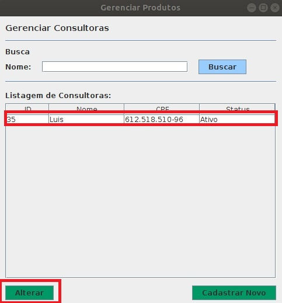

Em seguida altere os dados, sendo que caso queira inativa-la, basta marcar desmarcar a opção `status`. 

Para salvar as alterações, basta clicar no botão `salvar`, conforme exibido abaixo.
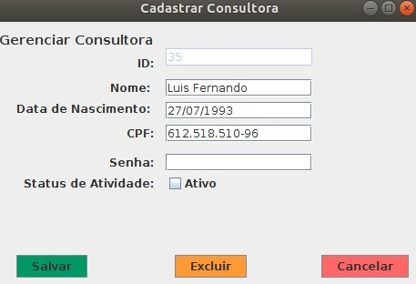

### Gerenciar Notificações
#### Listar Notificações
Para `listar todas as notificações`, clique no menu de Notificação, a partir do menu principal.

Em seguida, a tela de listagem de notificações estará disponível, conforme exibido abaixo.

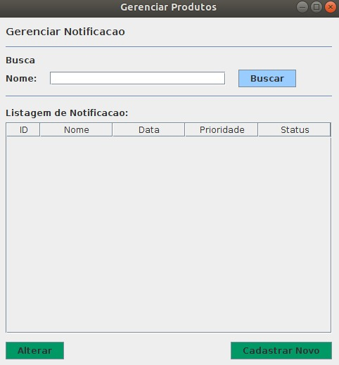
#### Inserir Notificações
Para `inserir uma notificação`, clique no botão `Cadastrar Novo`, a partir da tela de listagem de notificações, conforme exibido abaixo.

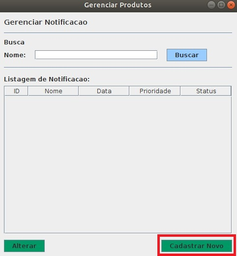

Em seguida preencha os dados solicitados e clique no botão `salvar`, conforme exibido abaixo.

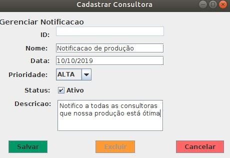
#### Alterar Notificações
Para `alterar e inativar uma notificação`, clique no nome da notificação derejada, conforme exibido abaixo.

Em seguida altere os dados, sendo que caso queira inativa-la, basta marcar desmarcar a opção `status`. 

Para salvar as alterações, basta clicar no botão `salvar`, conforme exibido abaixo.
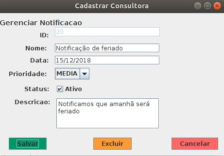

