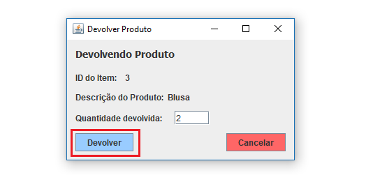

# ISS Ateliê

## William Rodrigues

### Gerenciar Produtos
#### Listar Produtos
Para `listar todos os Produtos`, já na tela inicial do sistema clique sobre o menu Produtos, conforme exibido abaixo.

#### Cadastrar novo Produto
Para `Cadastrar um novo Produto`, clique sobre o botão `Cadastrar Novo`, conforme exibido abaixo.

Em seguida preencha os dados solicitados e clique no botão `Cadastrar`, conforme exibido abaixo.

#### Alterar Produto já cadastrado
Para `Alterar um Produto`, clique no nome da Produto a ser alterado, e clique sobre o botão `Mais Detalhes`, conforme exibido abaixo.

Em seguida a tela de edição será carregada com os dados do Produto selecionado.
Altere os dados e para salvar as alterações, basta clicar no botão `Salvar`, conforme exibido abaixo.

### Estoque de Produtos
#### Listar Estoque de Produtos
Para `Listar todo Estoque`, já na tela de gerenciamento de produtos clique sobre o botão `Ir para Estoque de Produtos`, conforme exibido abaixo.

#### Editar Estoque de Produtos
Para `Editar um Produto no estoque`, clique no nome da Produto a ser alterado, e clique sobre o botão `Editar`, conforme exibido abaixo.

Em seguida a tela de edição será carregada com os dados do Produto selecionado.
Altere a quantidade e para salvar as alterações, basta clicar no botão `Salvar`, conforme exibido abaixo.

### Relatório de Frequência
#### Gerar Relatório de Frequência
Para gerar o `Relatório de Frequência` referente a uma consultora, já na tela inicial de sistema clique sobre o menu `Relatórios` e em seguida no sub-menu `Frequência`, conforme exibido à seguir.

Será aberta uma tela solicitando o CPF da consultora a qual será gerado o relatório. Preencha o campo de CPF e clique sobre o botão `Gerar Relatório`, conforme exibido à seguir.

### Gerenciar Sacolas
#### Listar Sacolas
Para `listar todos as Sacolas`, já na tela inicial do sistema clique sobre o menu Sacolas, conforme exibido abaixo.

#### Criar nova Sacola
Para `Criar uma nova Sacola`, clique sobre o botão `Criar Nova Sacola`, conforme exibido abaixo.

Para `Associar uma consultora à Sacola` preencha o campo CPF com o respectivo CPF da consultora e clique sobre o botão `Associar Consultora`, conforme exibido à seguir.

Preencha também o campo de `Data de Acerto` com a data em que a consultora deverá realizar o acerto da Sacola criada.
O formato da data deve seguir o padrão dd/MM/aaa. A data de criação da Sacola será obtida automaticamente a partir do data atual.

Para `Associar Produtos à Sacola` clique sobre o botão `Adicionar Produtos a Sacola` conforme exibido à seguir.

Selecione o Poruto na tabela , preencha o campo com a quantidade e clique sobre o botão `Confirmar`, conforme exibido à seguir.

Com a Consultora e Produtos ja associados à sacola, para finalizar a criação da Sacola clique sobre o botão `Criar Sacola`

#### Gerando Termo de Ciência da Consultora
Após criar uma nova Sacola, será exibida a mensagem perguntando se deseja gerar o Termo de Ciência. 
Para gera-lo basta clicar na opção `Sim`, conforme indica a imagem à seguir, e o Termo será gerado automaticamente em um documento no formato PDF.

Nota: A ação de gerar o Termo de Ciência pode ser executada a qualquer momento pela tela de `Detalhes de uma Sacola` enquanto a Sacola não for finalizada. Conforme Exibido à seguir.

#### Detalhes da Sacola
Para acessar os `Detalhes de uma Sacola`, já na tela de Gerenciamento de Sacolas, selecione a Sacola desejada na tabela e clique sobre o botão `Mais Detalhes`, conforme exibido à seguir.

#### Devolver Produto de uma Sacola
A ação de devolver Produtos é realizada quando uma Consultora, após o período estipulado de vendas, retorna ao Ateliê para realizar o acerto dos Produtos vendidos e devolver os Produtos que não foram vendidos.
Para realizar a `devolução de um Produto`, já na tela de detalhes de uma Sacola, selecione o produto a ser devolvido na tabela, e clique sobre o botão `Devolver Produto`, conforme exibido à seguir.

Em seguida digite a quantidade que será devolvida daquele Produto, no campo `Quantidade devolvida`, e clique sobre o botão `Devolver`. Conforme exibido à seguir.

#### Finalizar uma Sacola
Para `finalizar uma Sacola`, já na tela de Detalhes da Sacola, clique sobre o botão `Finalizar Sacola`, conforme exibido à seguir.

