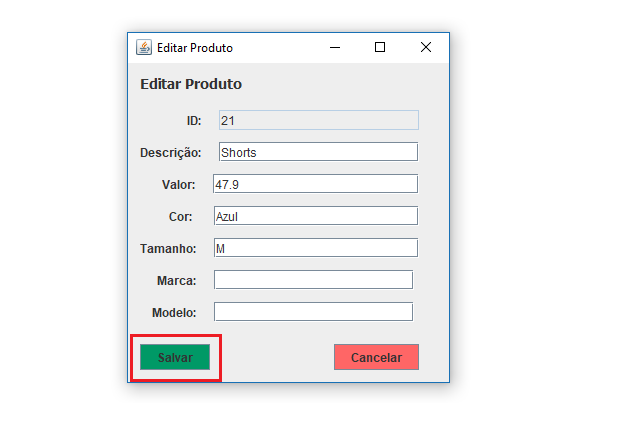
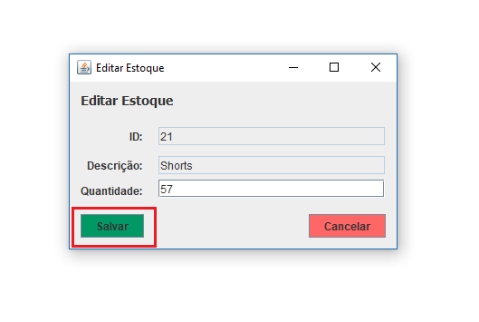
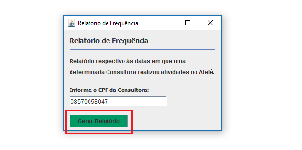

# ISS Ateliê

## William Rodrigues

### Gerenciar Produtos
#### Listar Produtos
Para `listar todos os Produtos`, já na tela inicial do sistema clique sobre o menu Produtos, conforme exibido abaixo.

#### Cadastrar novo Produto
Para `Cadastrar um novo Produto`, clique sobre o botão `Cadastrar Novo`, conforme exibido abaixo.

Em seguida preencha os dados solicitados e clique no botão `Cadastrar`, conforme exibido abaixo.

#### Alterar Produto já cadastrado
Para `Alterar um Produto`, clique no nome da Produto a ser alterado, e clique sobre o botão `Mais Detalhes`, conforme exibido abaixo.

Em seguida a tela de edição será carregada com os dados do Produto selecionado.
Altere os dados e para salvar as alterações, basta clicar no botão `Salvar`, conforme exibido abaixo.

### Estoque de Produtos
#### Listar Estoque de Produtos
Para `Listar todo Estoque`, já na tela de gerenciamento de produtos clique sobre o botão `Ir para Estoque de Produtos`, conforme exibido abaixo.

#### Editar Estoque de Produtos
Para `Editar um Produto no estoque`, clique no nome da Produto a ser alterado, e clique sobre o botão `Editar`, conforme exibido abaixo.

Em seguida a tela de edição será carregada com os dados do Produto selecionado.
Altere a quantidade e para salvar as alterações, basta clicar no botão `Salvar`, conforme exibido abaixo.

### Relatório de Frequência
#### Gerar Relatório de Frequência
Para gerar o `Relatório de Frequência` referente a uma consultora, já na tela inicial de sistema clique sobre o menu `Relatórios` e em seguida no sub-menu `Frequência`, conforme exibido à seguir.

Será aberta uma tela solicitando o CPF da consultora a qual será gerado o relatório. Preencha o campo de CPF e clique sobre o botão `Gerar Relatório`, conforme exibido à seguir.
